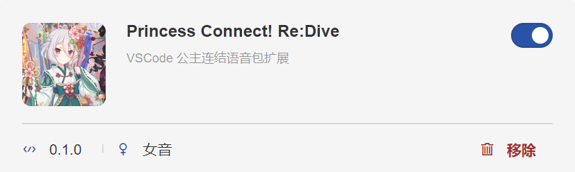
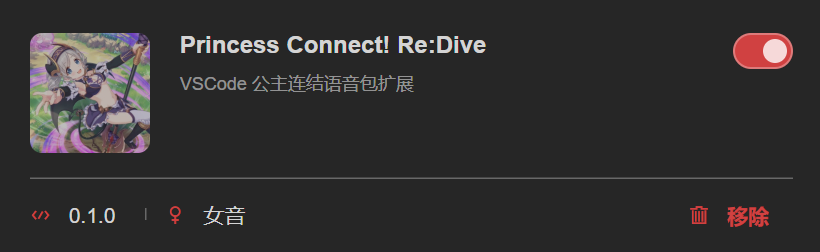

# Priconne rainbow-fart Voice Pack

Languages: [简体中文](./README.md) | English

This is Princess Connect! Re:Dive Voice Pack，an extension package derived from VSCode rainbow-fart🌈plugin [vscode-rainbow-fart](https://github.com/SaekiRaku/vscode-rainbow-fart).

Come and listen to waifu's voice when writing code!

## Preview

## Install

Refer to [official guide](https://saekiraku.github.io/vscode-rainbow-fart/#/zh/README.md) from `vscode-rainbow-fart`.

This project has already packed zip files for you，simply go to [Releases](https://github.com/sahuang/priconne-rainbow-fart/releases) and download the latest zip file.

In rainbow-fart configuration page from local VSCode, go to `Settings` -> `Voice Packages` -> `Import` and import zip，then enable to enjoy the voices!

## Others

Thanks to SaekiRaku for the awesome plugin.

v0.1.0 of this package contains voices for 60 characters（1001-1060), including most of Priconne Chinese Server characters. More to come. You are more than welcome to give advise on other vocal packs to add or any other suggestions.

My QQ Bot：[DragonBot，a QQ Bot designed for Priconne vocals](https://github.com/sahuang/DragonBot-ReDive).
